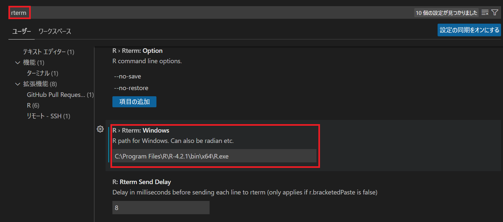
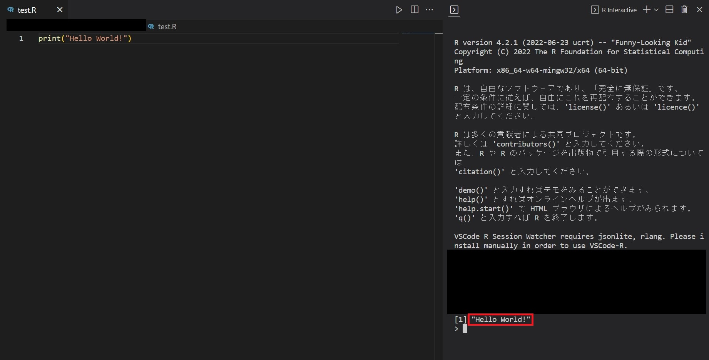

# RをWindows10のVSCodeで実行する


### Rをインストールする

[インストーラー](https://cran.r-project.org/) にてページ上部にある"Download R for Windows" > "base"の順でDLできます。

インストールはデフォルト設定のままで問題ないと思われます。


### VSCode側のRのパスを指定する

Ctrl + コンマをVSCode上で入力するとVSCodeの設定を開けます。

検索欄に"rterm"を入力し、R > Rterm: Windowsの欄に、インストールしたRのパスを選択します。




##### 参考

[R on VSCode on Windowsする](https://23prime.hatenablog.com/entry/2019/05/28/193046)


### 実行

以下のコードを実行してみました。画像のようにちゃんと出力がされているかと思います。

```R
print("Hello World!")
```




[トップページに戻る](index.md)
